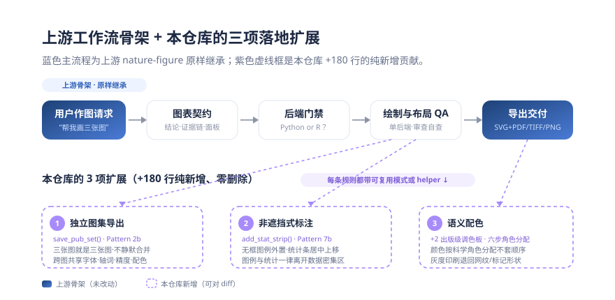
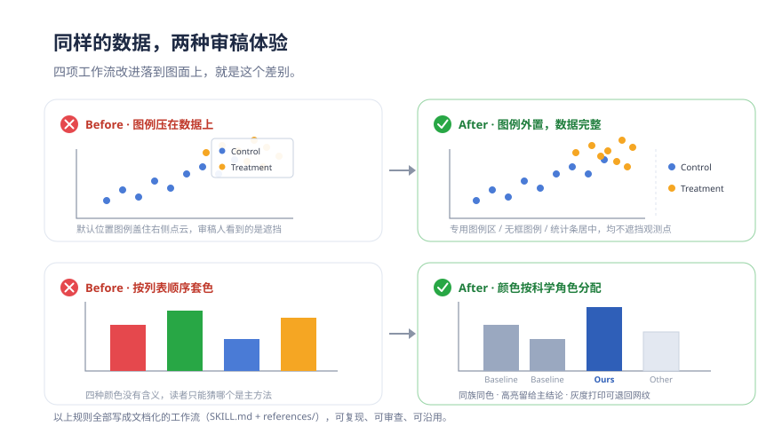
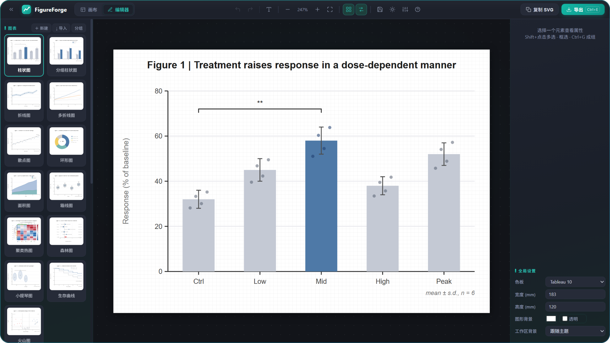

<div align="center">
  
</div>

<div align="center">

# 🎨 nature-figure-skill

### 让每一张论文配图，都经得起审稿人追问。

基于 [`Yuan1z0825/nature-skills`](https://github.com/Yuan1z0825/nature-skills) 快照的开源衍生仓库，
在上游 `nature-figure` 之上补齐了一套可审查的配图生产工作流：
**图表契约 · 阻断式后端门禁 · 独立图集导出 · 语义配色 · Python / R 单后端全套交付**。

[](LICENSE)
[](https://github.com/Yuan1z0825/nature-skills)
[](https://github.com/Yuan1z0825/nature-skills/commit/f3941a1722e39af78b24bc7a34167b8880629545)
[](#-本仓库改进了什么)

</div>

> [!IMPORTANT]
> 这是 `nature-skills`（袁一哲及贡献者）的**派生快照**。
> 上游 MIT 许可与署名保留在 [`LICENSE`](LICENSE) 与 [`DERIVATIVE_NOTICE.md`](DERIVATIVE_NOTICE.md)。
> 下文「[文件级贡献说明](#-文件级贡献说明可审查)」逐文件区分了本地修改与未改动的上游内容。

**目录**

- 🎯 [它解决什么](#-它解决什么) · ✨ [本仓库改进了什么](#-本仓库改进了什么全部可对代码) · 🏛️ [继承自上游的能力](#-继承自上游的能力署名归上游) · 🖼️ [落到图面上的效果](#️-落到图面上的效果)
- 🧪 [FigureForge 可视化编辑器](#-figureforge-浏览器里的可视化配图编辑器) · 📦 [产物长什么样](#-产物长什么样) · 🧭 [你能这样用](#-你能这样用) · 📚 [快照还包含什么](#-快照还包含什么)
- 🚀 [安装](#-安装) · 🛡️ [边界与不承诺](#️-边界与不承诺) · 🔍 [文件级贡献说明](#-文件级贡献说明可审查) · 📄 [派生声明与许可](#-派生声明与许可)

## 🎯 它解决什么

只要做过论文配图，大概率被这四件事折磨过：

- **三张图变一张图**：要的是三张独立 figure，拿到的却是被拼进一张画布的合集，投稿前还得手动拆开。
- **图例盖住数据**：图例默认位置正好压在点云上，统计标注挡掉观测点，审稿人第一眼就抓这个。
- **颜色没有含义**：颜色按列表顺序套，读者看不出哪个是主方法，换一次顺序含义就变一次。
- **组图各说各话**：字体、轴措辞、数值精度跨图不一致，返修时整套图被打回来统一。

上游 `nature-figure` 已经给了一套完整的配图工作流骨架；本仓库的贡献不是再造一套流程，
而是往这张「画布」上补齐**真正落地到画图动作的三类规则 + 两个可直接复用的 helper**——
它们对应上面四个痛点里最容易返工的部分。

## ✨ 本仓库改进了什么（全部可对代码）

修改围绕三个主题；
每条规则都配了可直接调用的模式或 helper，下文代码均摘自仓库。



### ① 独立图集导出：三张图就是三张图

新增规则：要求画多张独立图时，**禁止静默拼成一张大拼图**；每张图独立导出
SVG 主文件 + 投稿伴生版，并共享字体、轴措辞、颜色语义与统计精度
（[`SKILL.md`](skills/nature-figure/SKILL.md)、[`references/common-patterns.md`](skills/nature-figure/references/common-patterns.md) Pattern 2b）。

```python
def save_pub_set(fig, out_dir, stem, dpi=600):
    out_dir.mkdir(exist_ok=True)
    fig.savefig(out_dir / f'{stem}.svg', bbox_inches='tight')
    fig.savefig(out_dir / f'{stem}.pdf', bbox_inches='tight')
    fig.savefig(out_dir / f'{stem}.png', dpi=dpi, bbox_inches='tight')
    plt.close(fig)
```

规则要点：用户没要拼图就不建 multi-panel 页；整套图复用同一套轴措辞、统计精度、
图例位置与颜色语义；统计数字必须留有对应的 CSV/TSV 源表。

### ② 非遮挡式标注：一个观测点都不许挡

新增规则：图例、相关系数框、样本量等**一律离开数据密集区**，改用三种落地方案
（[`SKILL.md`](skills/nature-figure/SKILL.md)、Pattern 7b、[`references/api.md`](skills/nature-figure/references/api.md)）：

```python
# 方案一：无框图例外置到绘图区右侧
ax.legend(loc='center left', bbox_to_anchor=(1.02, 0.5), frameon=False, fontsize=6)

# 方案二：居中的无框统计条，放在轴正上方（新增 helper）
def add_stat_strip(ax, text, y=1.01, fontsize=6.8, color="#333333"):
    ax.text(0.5, y, text, transform=ax.transAxes,
            va="bottom", ha="center", fontsize=fontsize, color=color, clip_on=False)
```

统计条刻意不画边框——比数据更安静的 annot 才不会抢戏；相关系数默认 3–4 位有效数字，
标题与统计条冲突时把标题上移，而不是缩小字号。

### ③ 语义配色：颜色是科学语言

新增规则：用户给的颜色列表是「调色方向」而不是按序套用的映射——先定科学角色，再按
显著性分色（[`references/design-theory.md`](skills/nature-figure/references/design-theory.md) 六步角色分配工作流），并新增两个出版级调色板
（[`references/api.md`](skills/nature-figure/references/api.md)）：

```python
PALETTE_PUBLICATION_SOFT = {  # 混合分类汇总图：中饱和、高可读
    "green": "#66C2A5", "orange": "#FC8D62", "blue_lavender": "#8DA0CB",
    "pink": "#E78AC3", "lime": "#A6D854", "yellow": "#FFD92F",
    "tan": "#E5C494", "grey": "#B3B3B3"}

PALETTE_BLUE_ROSE = {         # 一致性/偏差双族图：冷色=一致，玫红=偏差
    "cyan": "#87D0E8", "pale_rose": "#FDF3F3", "rose": "#F9B7B7",
    "deep_red": "#9D2929", "soft_red": "#F7A8A8", "coral": "#F76B5A",
    "blue": "#1B86F7", "dusty_rose": "#F298A8"}
```

角色分配原则：中高饱和、易读的颜色给主结论与参照类别；最深的暖色只留给阈值/参照线等
方向性元素；灰或最浅的 pastel 给 `Other`/背景/残差；相邻堆叠段亮度太近就重排而不是换色；
小字号或灰度印刷可能失效时，加标记形状或网纹。同一图集内所有独立图保持同一套语义映射。

## 🏛️ 继承自上游的能力（署名归上游）

以下能力在基线 [`f3941a1`](https://github.com/Yuan1z0825/nature-skills/commit/f3941a1722e39af78b24bc7a34167b8880629545)
中已经存在，本快照原样继承、**未做修改**，也不计为本仓库的贡献：

- **图表契约**：先写一句话核心结论、证据链、面板角色与导出契约，再动代码。
- **阻断式后端门禁**：未选「Python or R」不画任何图；选定后单后端贯穿绘制/预览/导出/QA，缺依赖即停、不跨语言代画。
- **隐私规则**：私有路径、文件名、模板来源不进入图、图注与稿件文本。
- **Python / R 双后端快速上手与导出规范**：可编辑 SVG（`svg.fonttype="none"`）、
  TrueType PDF（`pdf.fonttype=42`）、600 dpi TIFF 等交付标准。

完整上游工作流见 [Yuan1z0825/nature-skills](https://github.com/Yuan1z0825/nature-skills)。

## 🖼️ 落到图面上的效果

同样的数据，改与不改，是两种审稿体验：



## 🧪 FigureForge — 浏览器里的可视化配图编辑器

不想写代码？**[FigureForge](figureforge/)** 让你先选模板骨架、再填内容，然后像 PPT 一样直接上手拖：

**在线打开（无需安装）**：[jing1312.github.io/nature-figure-skill/figureforge/](https://jing1312.github.io/nature-figure-skill/figureforge/)



核心能力：

- **智能参考线**：拖动元素时边缘/中心自动识别其他元素并"噔"地吸附对齐（BioRender / Figma 手感），按住 <kbd>Alt</kbd> 临时关闭。
- **多选与成组**：Shift+点击或框选多元素，Ctrl+G 成组、Ctrl+Shift+G 解组，批量改色、排列，全部支持撤销重做。
- **模板库管理**：内置 10 种图表 + 6 种布局；支持重命名、分组文件夹、删除、新建空白图、导入 SVG，左栏可收起。
- **会话自动保存**：每次编辑自动存入浏览器，关闭页面后重新打开接着改；也可导出 `.json` 项目文件。
- **多格式导出**：SVG / PNG / TIFF（含 dpi 元数据，可直接投稿）/ PPTX / JSON，分辨率 1×–4×、1280/1920px、300/600 dpi。
- **编辑增强**：插入文本框、坐标轴长度/粗细/颜色面板、方向键微移、滚轮缩放、拖入 SVG/PNG 文件、工作区背景换色。

与 AI 工作流的关系：FigureForge 不替代 `nature-figure` 的代码化出图——它覆盖**前期布局设计**（先定骨架再让 AI 填数据）和**后期微调**（AI 出图后拖两下改到位）两端。

## 📦 产物长什么样

本工作流的交付不是「一张位图」，而是**每张图一组文件**：

```text
figure-01.svg    ← 主产物：文字保持可编辑，编辑部可直接改字
figure-01.pdf    ← TrueType 嵌入，投稿伴生版
figure-01.tiff   ← 600 dpi，满足多数期刊印刷要求
figure-01.png    ← 预览/演示用
```

同一图集内的所有图共享字体、轴措辞、颜色语义与统计精度——返修时改一处，整套图一致更新。
仓库根目录的 `skill_scatter_plot` 是随快照引入的静态示例素材，不代表本工作流的实际产出，效果见仁见智。

## 🧭 你能这样用

| 场景 | 你可以这样问 |
|---|---|
| 画投稿级配图 | “根据这段结果画 Figure 3，投稿用，Python。” |
| 多张独立图 | “这三组结果分别出三张独立图，不要拼在一起。” |
| 指定颜色 | “用我给的颜色：A 方法蓝、B 方法同族浅蓝、对照灰。” |
| 修图返修 | “审稿人说图例挡住数据了，重排 Figure 2 布局。” |
| 组图统一 | “Figure 1–4 的字体、轴措辞和统计格式统一一遍。” |

标准工作顺序：图表契约 → 后端门禁 → 单后端绘制 → 布局与 QA → 独立导出 → 交付清单。

## 📚 快照还包含什么

派生快照同时带入了上游的九个科研技能目录。每个 `skills/nature-*` 是一个可独立安装的单元；
安装时**整目录复制**，不要只拷 `SKILL.md`（技能依赖各自的 `references/` 等文件）。

| 技能 | 快照状态 | 用途 |
| --- | --- | --- |
| [`nature-figure`](skills/nature-figure/README.md) | Stable | Python / R 投稿级科研配图工作流（**本仓库的扩展重点**） |
| [`nature-polishing`](skills/nature-polishing/README.md) | Stable | 学术文本润色 |
| [`nature-writing`](skills/nature-writing/README.md) | Draft | 稿件章节起草与重构 |
| [`nature-citation`](skills/nature-citation/README.md) | Beta | 文献检索与参考文献导出 |
| [`nature-data`](skills/nature-data/README.md) | Draft | 数据可用性与 FAIR 元数据指引 |
| [`nature-reader`](skills/nature-reader/README.md) | Beta | 基于原文的中英双语论文精读 |
| [`nature-response`](skills/nature-response/README.md) | Beta | 逐点回复审稿意见 |
| [`nature-paper2ppt`](skills/nature-paper2ppt/README.md) | Beta | 中文科研论文汇报 PPT |
| [`nature-academic-search`](skills/nature-academic-search/README.md) | Beta | 多源文献检索与参考文献管理 |

状态标签描述的是导入时的快照状况，不代表本仓库的独立验证；上游最新进展请以上游仓库为准。

## 🚀 安装

### 方式一：交给 Agent（推荐）

```text
请安装这个 Agent Skill：https://github.com/jing1312/nature-figure-skill
先审查仓库内容和 SKILL.md，再整目录安装到你当前 Agent 的 Skills 目录；
如果已安装旧版本，先备份再更新。完成后告诉我实际安装路径和验证结果。
```

### 方式二：手动安装本派生快照

```bash
git clone https://github.com/jing1312/nature-figure-skill.git
cd nature-figure-skill

# 只装 nature-figure（含本仓库的全部扩展）
mkdir -p ~/.codex/skills
cp -R skills/nature-figure ~/.codex/skills/
```

或安装快照里的全部技能：

```bash
mkdir -p ~/.codex/skills
for d in skills/nature-*; do
  cp -R "$d" ~/.codex/skills/
done
```

更细的安装说明见 [`install.md`](install.md)。注意：部分插件元数据仍署上游项目名并面向上游配置，
因此**手动整目录安装**是使用本派生快照最不容易出歧义的方式。


## 🔍 文件级贡献说明（可审查）

把初始派生提交 [`11fc2b8`](https://github.com/jing1312/nature-figure-skill/commit/11fc2b84a4fcd4f035b7a6f32045a9b2832c6a12)
与上游基线 [`f3941a1`](https://github.com/Yuan1z0825/nature-skills/commit/f3941a1722e39af78b24bc7a34167b8880629545)（2026-05-24）
文件比对：

| 文件 | 新增 | 本地贡献 |
| --- | ---: | --- |
| [`skills/nature-figure/SKILL.md`](skills/nature-figure/SKILL.md) | +9 | 三条工作流规则：独立图集导出与跨图一致、图例/统计不遮挡数据、颜色列表按语义角色分配 |
| [`skills/nature-figure/references/api.md`](skills/nature-figure/references/api.md) | +49 | `PALETTE_PUBLICATION_SOFT` / `PALETTE_BLUE_ROSE` 两个出版级调色板及适用场景；`add_stat_strip()` 无框统计条 helper 与标题间距配合技巧 |
| [`skills/nature-figure/references/common-patterns.md`](skills/nature-figure/references/common-patterns.md) | +103 | 外置图例模式（侧置/顶部无框）；Pattern 2b 独立图集导出（`save_pub_set()` + 源表规则）；语义角色配色字典与四条细则；Pattern 7b 非遮挡统计条 |
| [`skills/nature-figure/references/design-theory.md`](skills/nature-figure/references/design-theory.md) | +19 | 用户给定颜色的六步角色分配工作流；两组推荐调色板及适用图型 |

审计可复现（任意机器）：

```bash
git clone https://github.com/Yuan1z0825/nature-skills && git -C nature-skills checkout f3941a1
git clone https://github.com/jing1312/nature-figure-skill && git -C nature-figure-skill checkout 11fc2b8
diff -r nature-skills/skills/nature-figure nature-figure-skill/skills/nature-figure
```

除此之外：初始快照新增了 [`DERIVATIVE_NOTICE.md`](DERIVATIVE_NOTICE.md) 与根目录的
`skill_scatter_plot` 示例（随附静态素材，非工作流产出）；另有三个文献样例文件仅换行符不同，
**不**计为实质修改。`skills/nature-figure` 其余文件与上游逐字节一致；未改动的上游文件不主张任何
本地作者身份，上游的完整历史和后续社区贡献见[原仓库](https://github.com/Yuan1z0825/nature-skills)。

上表审计范围是**初始派生提交**；此后本仓库新增了 [`figureforge/`](figureforge/) 可视化编辑器
（纯前端，见上方[专章](#-figureforge-浏览器里的可视化配图编辑器)），属本仓库的独立增量，不与上游内容混叠。

## 📄 派生声明与许可

上游项目归 **Yuan Yizhe（袁一哲）** 及其贡献者所有，按 [MIT 许可](LICENSE) 分发；
本派生仓库保留原许可与版权。简明再分发须知见 [`DERIVATIVE_NOTICE.md`](DERIVATIVE_NOTICE.md)。


欢迎提交 Issue / PR 改进 `nature-figure` 工作流扩展；涉及上游内容变更的建议，请优先提给上游。
