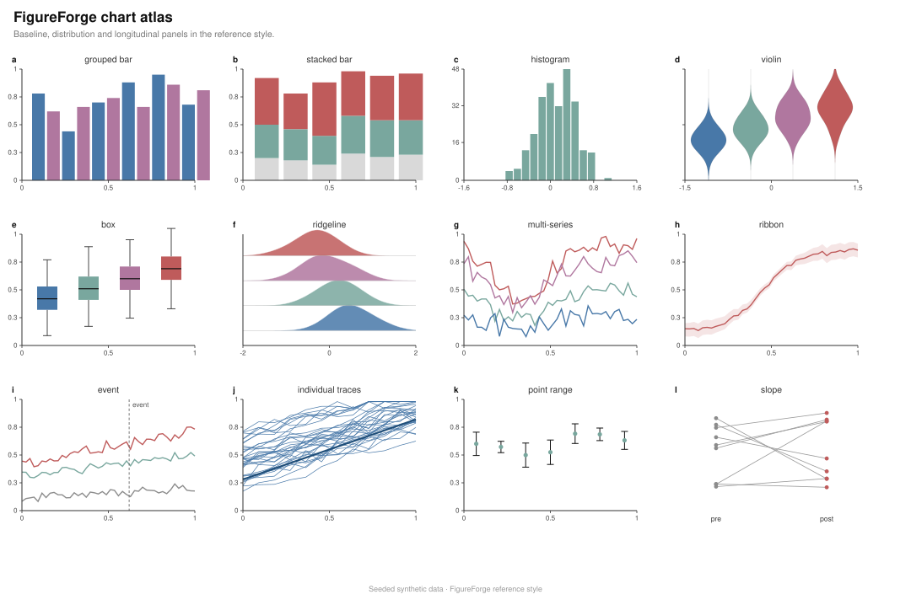
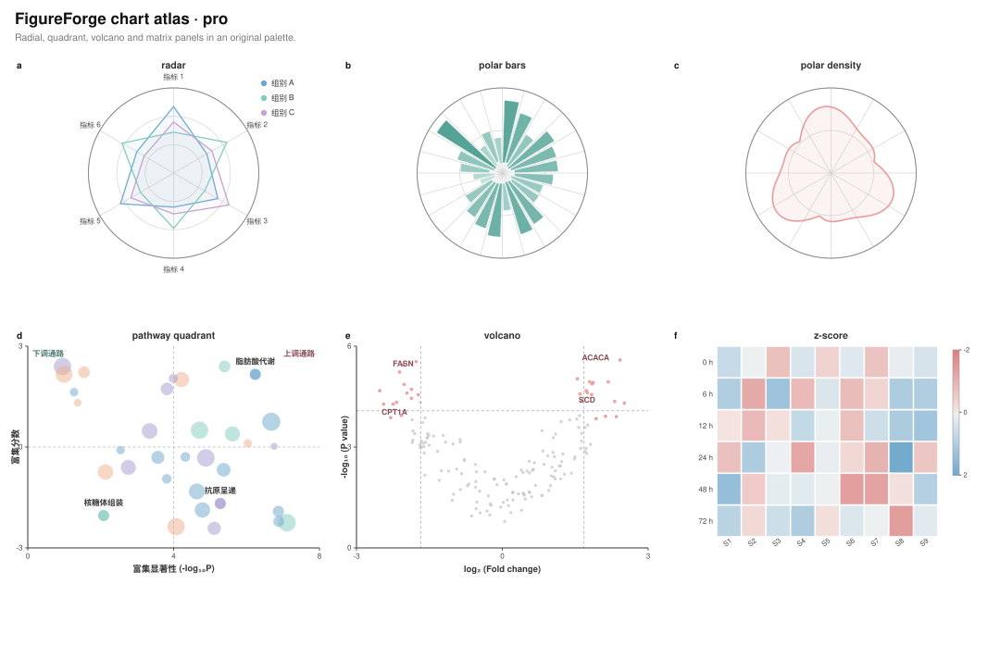
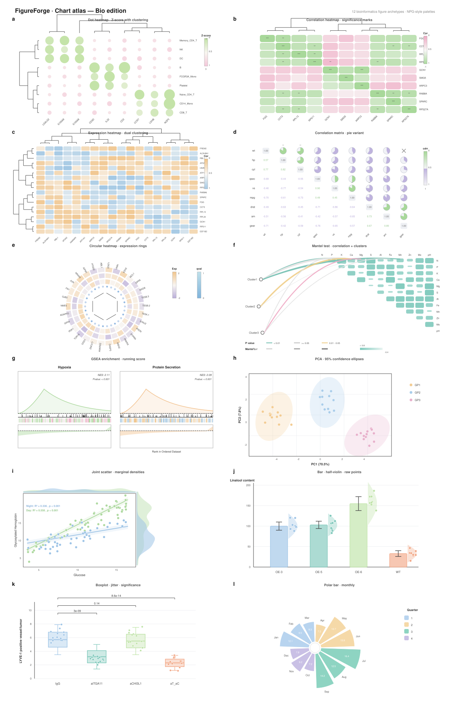
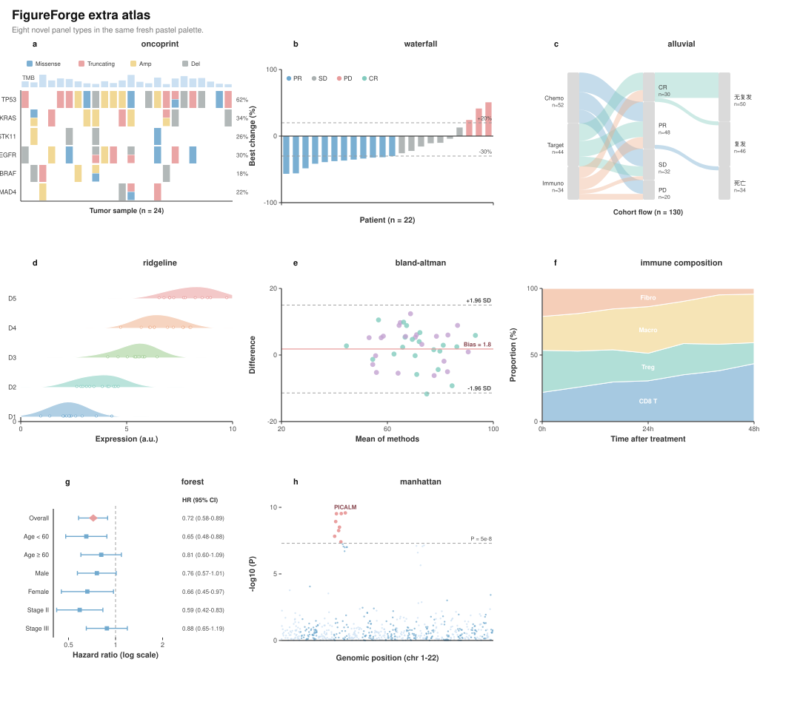
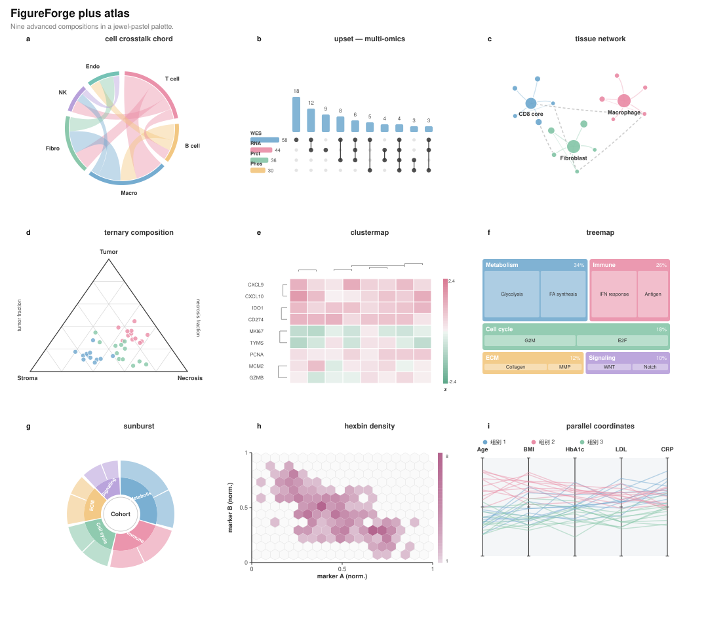
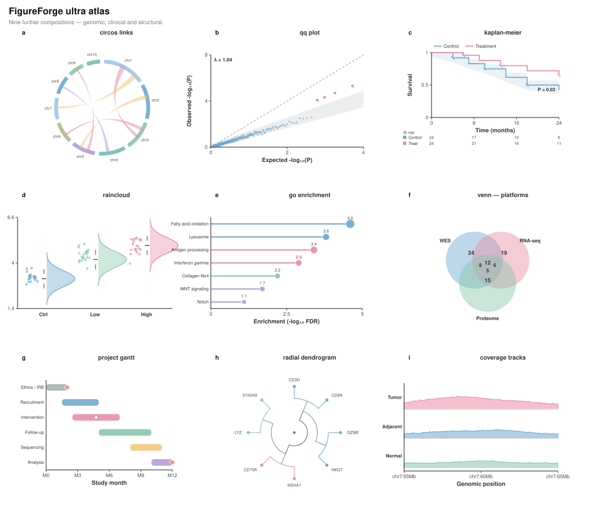
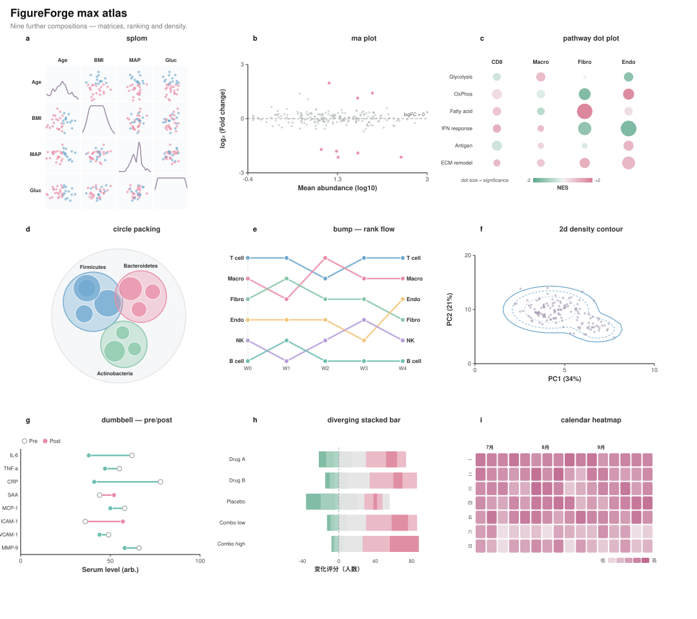

<div align="center">
  
</div>

<div align="center">

# 🎨 nature-figure-skill

### 浏览器里的论文配图工作室 —— 模板拖拽即用，Agent 工作流兜底

**两条路，同一个终点：投稿级配图。**
不想写代码？用 [FigureForge](figureforge/) 可视化编辑器：22 个出版级模板、16 组精选色卡，像 PPT 一样拖到位。
想全自动化？让 Agent 跑 [nature-figure 工作流](skills/nature-figure/SKILL.md)：图表契约 → 单后端绘制 → 独立导出，Python / R 双修。

[](LICENSE)
[](https://jing1312.github.io/nature-figure-skill/figureforge/)
[](#-模板长这样真实渲染)
[](#figureforge-核心能力)
[](#-naturefigure--agent-skill-出图工作流)

</div>

---

## ✨ 模板长这样（真实渲染）

下面每张图都是 FigureForge 内置模板的**真实输出**——不是效果图：选骨架、改数据、一键导出 SVG / PNG / TIFF / PPTX。

<div align="center">
  
</div>

**进阶图形**——组学、队列与项目管理级别的复杂图型，同样开箱即用：

<div align="center">
  
</div>

**生物信息图鉴**——簇状点阵热图、相关性矩阵、环形热图、Mantel 检验、GSEA、PCA 置信椭圆、边际密度散点等生信高频图型，NPG 风格配色：

<div align="center">
  
</div>

**进阶图鉴（新增）**——OncoPrint、瀑布图、冲积图、山脊图、Bland-Altman 一致性、免疫组成堆叠面积、森林图、曼哈顿图，8 个临床与组学高频图型：

<div align="center">
  
</div>

**高阶图鉴（新增）**——弦图、UpSet、网络图、三元相图、聚类热图、矩形树图、旭日图、六边形密度、平行坐标，9 个高阶构图：

<div align="center">
  
</div>

**Ultra 图鉴（新增）**——Circos 环状图、QQ 图、KM 生存曲线+风险表、雨云图、GO 棒棒糖图、维恩图、甘特图、放射状树状图、测序覆盖度轨道：

<div align="center">
  
</div>

**Max 图鉴（新增）**——散点矩阵、MA 图、通路点图、圆填充、排名凹凸图、二维等高线密度、哑铃图、发散堆叠条、日历热图：

<div align="center">
  
</div>


## 🧪 FigureForge — 不写代码的出图方式

**在线打开（无需安装）**：[jing1312.github.io/nature-figure-skill/figureforge/](https://jing1312.github.io/nature-figure-skill/figureforge/)

<div align="center">
  
</div>

### 核心能力

- **22 个出版级模板**：柱状图（superplot 原始点叠加）、聚类热图（行列树状图 + 发散色阶）、火山图、森林图、KM 生存曲线、小提琴图、箱线图、多面板综合图……全部按投稿标准预置误差棒、显著性括号、置信带与图例位置。
- **16 组精选色卡**：Tableau 10、Tol Muted、Economist、莫兰迪、马卡龙、Candy 粉蓝绿黄紫、Berry 蓝紫粉同族等；**系列联动改色**——改一处颜色，同系列数据点、图例、色标全部同步，一次撤销整组回退。
- **Figma 手感编辑**：智能参考线吸附（<kbd>Alt</kbd> 临时关闭）、Shift+点击 / 框选多选、Ctrl+G 成组、四角手柄缩放、方向键微移、全程撤销重做。
- **位图编辑套件**：拖入或 Ctrl+V 粘贴截图即可上画布，双击裁剪、90° 旋转、镜像、亮度/对比度/饱和度调整。
- **昼夜双主题**：☀ / 🌙 一键切换，全屏星空过渡动画；工作区背景 14 种可选。
- **会话自动保存**：编辑实时存入浏览器，关页重开接着改；也可导出 `.json` 项目文件。
- **多格式导出**：SVG（文字可编辑）/ PNG / TIFF（含 dpi 元数据，可直接投稿）/ PPTX，分辨率 1×–4×、300/600 dpi。

与 AI 工作流的关系：FigureForge 不替代代码化出图——它覆盖**前期布局设计**（先定骨架再填数据）和**后期微调**（AI 出图后拖两下改到位）两端。

## 🤖 nature-figure — Agent Skill 出图工作流

把 SKILL.md 装进你的 Agent（Claude Code / Codex 等），配图就从「一次性脚本」变成「可审查的生产线」：

```text
图表契约 → 后端门禁 → 单后端绘制 → 布局与 QA → 独立导出 → 交付清单
```


工作流内置三条硬规则，对应配图返工的三大重灾区：

**① 独立图集导出** —— 三张图就是三张图，禁止静默拼成一张；整套图共享字体、轴措辞、颜色语义与统计精度。

```python
def save_pub_set(fig, out_dir, stem, dpi=600):
    fig.savefig(out_dir / f'{stem}.svg',  bbox_inches='tight')  # 主产物：可编辑
    fig.savefig(out_dir / f'{stem}.pdf',  bbox_inches='tight')  # TrueType 嵌入
    fig.savefig(out_dir / f'{stem}.tiff', dpi=dpi, bbox_inches='tight')  # 印刷
    plt.close(fig)
```

**② 非遮挡式标注** —— 图例、统计框一律离开数据密集区；统计条无框、比数据安静：

```python
ax.legend(loc='center left', bbox_to_anchor=(1.02, 0.5), frameon=False, fontsize=6)
add_stat_strip(ax, 'Pearson r = 0.83, n = 46')   # 内置 helper
```

**③ 语义配色** —— 颜色是科学语言：先定角色（主方法 / 对照 / 阈值 / 背景），再按显著性分色；用户给的颜色列表是「调色方向」而不是按序套用。

<div align="center">
  
</div>

## 🚀 快速开始

**浏览器（零安装）**：直接打开 [FigureForge 在线版](https://jing1312.github.io/nature-figure-skill/figureforge/)，选模板开始拖。

**交给 Agent**：

```text
请安装这个 Agent Skill：https://github.com/jing1312/nature-figure-skill
先审查仓库内容和 SKILL.md，再整目录安装到你当前 Agent 的 Skills 目录。
完成后告诉我实际安装路径和验证结果。
```

**手动安装**（整目录复制，技能依赖 `references/` 等文件）：

```bash
git clone https://github.com/jing1312/nature-figure-skill.git
cd nature-figure-skill
mkdir -p ~/.codex/skills
cp -R skills/nature-figure ~/.codex/skills/    # 主力技能，含全部扩展
```

更多细节见 [`install.md`](install.md)。

## 📦 交付产物

不是「一张位图」，而是**每张图一组投稿级文件**：

```text
figure-01.svg    ← 主产物：文字保持可编辑，编辑部可直接改字
figure-01.pdf    ← TrueType 嵌入，投稿伴生版
figure-01.tiff   ← 600 dpi，满足多数期刊印刷要求
figure-01.png    ← 预览/演示用
```

## 🗺 Roadmap

- [x] 22 个出版级模板 + 16 组色卡
- [x] 昼夜主题 / 位图编辑套件 / 系列联动改色 / 撤销重做全覆盖
- [x] 多行文本编辑（tspan 拆行）
- [x] 矢量 PDF 导出（svg2pdf.js + jsPDF，文字保持可选中）
- [ ] 柱状图 hatch / 点纹理填充（黑白印刷友好）
- [ ] 雷达图、效应量漏斗图、甘特时间轴等新模板
- [ ] FigureForge ↔ Python 管线闭环（编辑器 SVG → `save_pub_set` 一键补齐 PDF/TIFF）
- [ ] 期刊规格预设：89 / 183 mm 栏宽检查、字号下限检查
- [ ] 色觉无障碍模拟预览
- [ ] GitHub Actions：模板 XML 有效性 + 语法门禁

## 📚 随仓库附带的科研技能包

<details>
<summary>九个 <code>nature-*</code> 技能（点击展开）</summary>

每个 `skills/nature-*` 都是可独立安装的单元；安装时**整目录复制**。

| 技能 | 状态 | 用途 |
| --- | --- | --- |
| [`nature-figure`](skills/nature-figure/README.md) | Stable | Python / R 投稿级配图工作流（**本仓库扩展重点**） |
| [`nature-polishing`](skills/nature-polishing/README.md) | Stable | 学术文本润色 |
| [`nature-writing`](skills/nature-writing/README.md) | Draft | 稿件章节起草与重构 |
| [`nature-citation`](skills/nature-citation/README.md) | Beta | 文献检索与参考文献导出 |
| [`nature-data`](skills/nature-data/README.md) | Draft | 数据可用性与 FAIR 元数据指引 |
| [`nature-reader`](skills/nature-reader/README.md) | Beta | 中英双语论文精读 |
| [`nature-response`](skills/nature-response/README.md) | Beta | 逐点回复审稿意见 |
| [`nature-paper2ppt`](skills/nature-paper2ppt/README.md) | Beta | 中文科研论文汇报 PPT |
| [`nature-academic-search`](skills/nature-academic-search/README.md) | Beta | 多源文献检索与文献管理 |

</details>

## 🔍 派生透明度

<details>
<summary>与上游 <code>Yuan1z0825/nature-skills</code> 的关系（点击展开）</summary>

本仓库的 `nature-figure` 工作流在 [`Yuan1z0825/nature-skills`](https://github.com/Yuan1z0825/nature-skills)（袁一哲及贡献者，MIT）基线 [`f3941a1`](https://github.com/Yuan1z0825/nature-skills/commit/f3941a1722e39af78b24bc7a34167b8880629545) 之上扩展而来；[`FigureForge`](figureforge/) 编辑器为本仓库原创。上游 MIT 许可与署名保留于 [`LICENSE`](LICENSE) 与 [`DERIVATIVE_NOTICE.md`](DERIVATIVE_NOTICE.md)。

初始派生提交 [`11fc2b8`](https://github.com/jing1312/nature-figure-skill/commit/11fc2b84a4fcd4f035b7a6f32045a9b2832c6a12) 的文件级改动（可审计）：

| 文件 | 本地贡献 |
| --- | --- |
| [`SKILL.md`](skills/nature-figure/SKILL.md) | 三条工作流规则：独立图集导出、标注不遮挡数据、语义角色配色 |
| [`references/api.md`](skills/nature-figure/references/api.md) | 两个出版级调色板；`add_stat_strip()` 无框统计条 helper |
| [`references/common-patterns.md`](skills/nature-figure/references/common-patterns.md) | 外置图例模式；Pattern 2b 独立图集导出（`save_pub_set()`）；语义配色细则 |
| [`references/design-theory.md`](skills/nature-figure/references/design-theory.md) | 六步颜色角色分配工作流 |

审计可复现：

```bash
git clone https://github.com/Yuan1z0825/nature-skills && git -C nature-skills checkout f3941a1
git clone https://github.com/jing1312/nature-figure-skill && git -C nature-figure-skill checkout 11fc2b8
diff -r nature-skills/skills/nature-figure nature-figure-skill/skills/nature-figure
```

</details>

## 📄 许可与致谢

- **FigureForge 编辑器**及本仓库的文档、模板扩展 © jing1312，按 MIT 许可发布。
- `nature-*` 技能内容衍生自 [Yuan1z0825/nature-skills](https://github.com/Yuan1z0825/nature-skills) © Yuan Yizhe 及其贡献者，MIT 许可；原版权声明保留于 [`LICENSE`](LICENSE)。
- 欢迎提 Issue / PR；也欢迎直接用 [在线编辑器](https://jing1312.github.io/nature-figure-skill/figureforge/) 出你的下一张投稿图。
