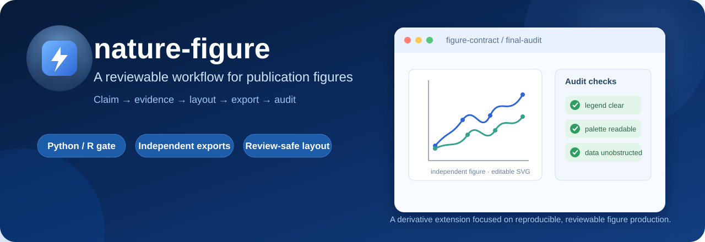
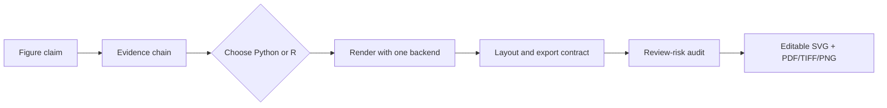

# nature-figure-skill

<div align="center">
  
</div>

<div align="center">

### A reviewable workflow for publication figures

An independently hosted derivative snapshot of [`Yuan1z0825/nature-skills`](https://github.com/Yuan1z0825/nature-skills), with a focused, publication-oriented extension of the `nature-figure` workflow.

[](LICENSE)
[](#backend-and-runtime-contract)
[](#backend-and-runtime-contract)
[](#scope-and-attribution)

</div>

> [!IMPORTANT]
> This is a derivative project, not a replacement for the upstream `nature-skills` repository. The upstream MIT licence and attribution are preserved in [`LICENSE`](LICENSE) and [`DERIVATIVE_NOTICE.md`](DERIVATIVE_NOTICE.md). The sections below distinguish the local contribution from unchanged upstream material.

## Why this contribution matters

The local work turns a figure-style guide into an explicit production workflow. It addresses failure modes that repeatedly appear in manuscript figures: ambiguous backend choices, accidental composite exports, annotations covering data, arbitrary colour assignment, and inconsistent figure sets.

The contribution is best understood as **workflow engineering for scientific communication**. It does not claim to replace the upstream project or invent a new plotting library; it makes the existing figure guidance more deterministic, inspectable, and practical for manuscript production.

## Workflow at a glance



The important design decision is the order: scientific intent and review risks are resolved before code and aesthetics. The selected backend remains exclusive through rendering, previewing, export, and visual QA.

### 1. A figure contract before plotting

The workflow now treats the scientific claim, evidence chain, panel roles, backend, export formats, statistics, and review risks as one contract. Python or R is a blocking choice, and the selected backend is used exclusively for drawing, previewing, exporting, and visual QA. If the selected runtime or packages are unavailable, the workflow stops and reports the blocker instead of silently falling back to another language.

This makes the process reproducible and auditable, rather than leaving important decisions to ad hoc plotting code.

### 2. Independent figure-set exports

When a user requests several plots, each figure is exported as its own primary SVG with manuscript-ready companions. Shared typography, axis wording, colour semantics, statistic precision, and file naming keep the set coherent without silently turning separate figures into one composite page.

### 3. Layout that protects the data

Legends, correlation summaries, sample sizes, and other statistics are moved outside dense data regions. The added patterns provide dedicated legend axes, frameless outside legends, direct labels, and centred statistic strips so annotations remain readable without hiding observations.

### 4. Scientific, role-based colour semantics

Supplied colours are interpreted by scientific role instead of being assigned mechanically by list order. Method families stay visually coherent; high-salience colours carry the main claim; neutral tones represent background or `Other`; green and red are reserved mainly for directional changes. The extension adds publication-oriented palettes, including a low-saturation `NMI pastel` family, and recommends hatching or marker shape when colour alone will not survive print or grayscale reproduction.

### 5. Publication-ready output discipline

The workflow keeps text editable in SVG, treats source data and statistics as part of the figure, and standardises SVG/PDF/TIFF/PNG export helpers. It also adds a user-facing privacy rule so private paths, filenames, and template provenance are not leaked into generated figures, reports, or manuscript text.

## Backend and runtime contract

The backend gate is a real operating rule, not a preference badge:

| Stage | Contract |
| --- | --- |
| Selection | Ask for Python or R when the request does not already establish a backend |
| Rendering | Use only the selected backend for drawing, previewing, exporting, and visual QA |
| Missing dependencies | Stop with the exact blocker instead of silently switching languages |
| Delivery | Keep source data, statistics, editable text, and export formats reviewable |

This makes a figure reproducible across revisions and prevents a quick workaround from changing the final visual result.

## Contribution map

| Problem in a manuscript figure workflow | Local response | Where to inspect |
| --- | --- | --- |
| Separate requested plots get silently combined | Independent file stems and shared export contract | `SKILL.md`, `references/common-patterns.md` |
| Legends or statistics cover the data cloud | Outside legends, legend-only axes, statistic strips | `references/common-patterns.md`, `references/api.md` |
| Custom colour lists are applied in arbitrary order | Role-based mapping, family palettes, grayscale fallback | `SKILL.md`, `references/design-theory.md` |
| Text becomes hard to edit after export | SVG text remains real text; PDF/TIFF/PNG are companions | `references/api.md` |
| Private template provenance leaks into output | User-facing privacy rule | `SKILL.md` |

## Why these changes matter

These are not cosmetic defaults. They reduce review and production risk at the points where otherwise-polished figures most often fail: the claim is obscured by layout, the output is difficult to edit, a multi-figure set is inconsistent, or a colour choice changes the scientific meaning. The result is a workflow that is easier to reproduce, inspect, revise, and hand to a journal-production process.

The extensions do not guarantee journal acceptance and do not replace journal-specific author instructions, statistical review, accessibility checks, or scientific validation.

## Scope and attribution

The initial derivative snapshot was compared with upstream commit [`f3941a1`](https://github.com/Yuan1z0825/nature-skills/commit/f3941a1722e39af78b24bc7a34167b8880629545) (24 May 2026). Substantive local edits are concentrated in four `nature-figure` workflow files, plus the derivative notice and the root-level scatter-plot examples:

| File | Local contribution |
| --- | --- |
| [`skills/nature-figure/SKILL.md`](skills/nature-figure/SKILL.md) | Figure contract, exclusive backend execution, independent exports, non-obstructing annotations, semantic colour assignment, and privacy guidance |
| [`skills/nature-figure/references/api.md`](skills/nature-figure/references/api.md) | Publication-oriented palettes, editable-SVG rules, and the frameless statistic-strip helper |
| [`skills/nature-figure/references/common-patterns.md`](skills/nature-figure/references/common-patterns.md) | Dedicated legend layouts, independent-figure export patterns, semantic palette mapping, and non-obstructing statistics |
| [`skills/nature-figure/references/design-theory.md`](skills/nature-figure/references/design-theory.md) | Rationale for colour roles, contrast, typography, layout, and export decisions |

The initial snapshot also added [`DERIVATIVE_NOTICE.md`](DERIVATIVE_NOTICE.md) and the `skill_scatter_plot` PNG/SVG examples. Three bibliographic sample files differ only in line endings and are not claimed as substantive modifications. Unchanged upstream files remain upstream material; later upstream development belongs in the [original repository](https://github.com/Yuan1z0825/nature-skills).

## Included snapshot

The repository contains nine reusable instruction bundles. Each `skills/nature-*` directory is one portable unit; copy the whole directory because a skill may depend on references, assets, scripts, or a local README.

| Skill | Snapshot status | Purpose |
| --- | --- | --- |
| [`nature-figure`](skills/nature-figure/README.md) | Stable | Scientific-figure workflow for Python and R |
| [`nature-polishing`](skills/nature-polishing/README.md) | Stable | Academic prose polishing |
| [`nature-writing`](skills/nature-writing/README.md) | Draft | Manuscript section drafting and restructuring |
| [`nature-citation`](skills/nature-citation/README.md) | Beta | Citation retrieval and reference export |
| [`nature-data`](skills/nature-data/README.md) | Draft | Data-availability and FAIR metadata guidance |
| [`nature-reader`](skills/nature-reader/README.md) | Beta | Source-grounded bilingual paper reading |
| [`nature-response`](skills/nature-response/README.md) | Beta | Point-by-point reviewer responses |
| [`nature-paper2ppt`](skills/nature-paper2ppt/README.md) | Beta | Chinese scientific-paper presentations |
| [`nature-academic-search`](skills/nature-academic-search/README.md) | Beta | Multi-source academic search and reference management |

Status labels describe the imported snapshot and are not independent validation by this repository.

## Installation

### Install this derivative snapshot

```bash
git clone https://github.com/jing1312/nature-figure-skill.git
cd nature-figure-skill
```

For a Codex-compatible local skill library, install one complete skill directory:

```bash
mkdir -p ~/.codex/skills
cp -R skills/nature-figure ~/.codex/skills/
```

Or install every skill contained in this snapshot:

```bash
mkdir -p ~/.codex/skills
for d in skills/nature-*; do
  cp -R "$d" ~/.codex/skills/
done
```

For a longer snapshot-specific walkthrough, see [`install.md`](install.md). Some plugin metadata remains attributed to and configured for the upstream project, so manual directory installation is the least ambiguous way to use this derivative snapshot.

### Use the latest upstream version

```bash
git clone https://github.com/Yuan1z0825/nature-skills.git
cd nature-skills
```

Follow the current [upstream README](https://github.com/Yuan1z0825/nature-skills#readme) for supported installation methods and the latest skill set.

## Attribution and licence

The upstream project is credited to Yuan Yizhe and its contributors. This derivative retains the original MIT licence in [`LICENSE`](LICENSE). See [`DERIVATIVE_NOTICE.md`](DERIVATIVE_NOTICE.md) for the redistribution notice.

When redistributing this repository:

1. retain the original copyright and licence;
2. identify it as a derivative of `Yuan1z0825/nature-skills`;
3. distinguish local modifications from unchanged upstream material; and
4. do not imply endorsement or official affiliation with the upstream maintainers.
